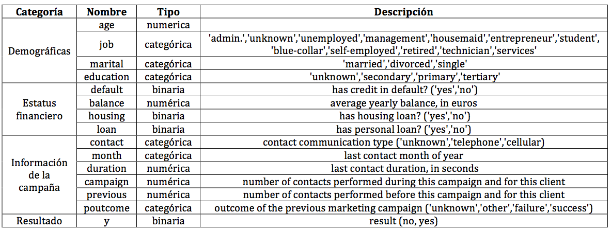

##Descripción de la base de datos

Los datos están relacionados con las campañas de marketing de una institución bancaria de Portugal. Abarca 17 campañas que ocurrieron entre mayo 2008 y noviembre 2010, las campañas consisten en llamadas a clientes sumando 40,690 contactos en esta base de datos. En las llamadas se ofrecía un contrato a largo plazo para invertir dinero, con tasas de interés atractivas (de acuerdo al banco). En cada contacto se registraban 16 atributos que incluyen la respuesta del cliente, esto es si el cliente contrató el producto o no.

Las variables son las siguientes:



La institución bancaria quisiera conocer como están relacionadas estas variables, en particular, quisieran entender la relación con la variable respuesta y.

```{r, echo=FALSE}
setwd('/home/mbc/Dropbox/ITAM_Dropbox/Estadística Multivariada/Examen 1')
```

```{r, message=FALSE}
library(dplyr)
library(ggplot2)
library(bnlearn)
library(gRain)
library(tidyr)
library(SDMTools)
load('./Datos/mkt.Rdata')
```

Dividimos la muestra en un conjunto de prueba y uno de entrenamiento.

```{r}
set.seed(18937)
mkt_train <- sample_n(mkt, 30000)
mkt_test <- anti_join(mkt, mkt_train)
```

Tenemos en la descripción de la base de datos que hay algunas variables numéricas. Vamos a categorizar estas variables, pues si hay pocas observaciones sobre algún número en particular, puede haber estimaciones ruidosas. Esto se puede ver gráficamente en los histogramas siguientes.

```{r, message=FALSE}
qplot(mkt_train$age) + 
  ggtitle("Distribución de la edad") + 
  theme(plot.title = element_text(lineheight=.8, face="bold")) + 
  xlab("Edad") +
  ylab("Num. de personas")

qplot(mkt_train$balance) + 
  ggtitle("Distribución del balance") + 
  theme(plot.title = element_text(lineheight=.8, face="bold")) + 
  xlab("Balance en euros") +
  ylab("Num. de personas")

qplot(mkt_train$duration) + 
  ggtitle("Distribución de la duración") + 
  theme(plot.title = element_text(lineheight=.8, face="bold")) + 
  xlab("Duración") +
  ylab("Num. de personas")

qplot(mkt_train$campaign) + 
  ggtitle("Distribución de las veces que se \n contactó con el cliente durante la campaña") + 
  theme(plot.title = element_text(lineheight=.8, face="bold")) + 
  xlab("Veces que se contactó con el cliente") +
  ylab("Num. de personas")

qplot(mkt_train$previous) + 
  ggtitle("Distribución de las veces que se había \n contactado con el cliente antes de la campaña") + 
  theme(plot.title = element_text(lineheight=.8, face="bold")) + 
  xlab("Veces que se contactó con el cliente") +
  ylab("Num. de personas")
```

Como se puede apreciar en los histogramas, todas las variables están sesgadas hacia algún lado y tienen valores extremos con pocas observaciones.

Para evitar esto, vamos a categorizar cada una de las variables anteriores en intervalos tales que la cantidad de clientes en cada intervalo sea más o menos igual. 

* A *age* se le dividirá en 15 grupos de edad, de esta forma hay una distancia promedio de `r round((max(mkt_train$age)-min(mkt_train$age))/15,2)` años de diferencia entre en grupo y otro.

* A *balance* se le dividirá en 15 grupos, de esta forma hay una distancia promedio de `r round((max(mkt_train$balance)-min(mkt_train$balance))/15,2)` euros de diferencia entre en grupo y otro.

* A *duration* se le dividirá en 5 grupos, de esta forma hay una distancia promedio de `r round((max(mkt_train$duration)-min(mkt_train$duration))/5,2)` segundos (`r round((max(mkt_train$duration)-min(mkt_train$duration))/(20*60),2)` minutos) de diferencia entre en grupo y otro.

* A *campaign* se le dividirá en 3 grupos.

* A *previous* se le dividirá en 2 grupos, ahora dirá si se había contactado con el cliente en la campaña anterior o no. Tendrá el valor TRUE si había sido contactado anteriormente y FALSE si no.

```{r}
mkt_train$age_cat <- cut(mkt_train$age, quantile(mkt_train$age, probs=(0:15)/15))
mkt_train$balance_cat <- cut(mkt_train$balance, quantile(mkt_train$balance, probs=(0:15)/15))
mkt_train$duration_cat <- cut(mkt_train$duration, quantile(mkt_train$duration, probs=(0:5)/5))
mkt_train$campaign_cat <- cut(mkt_train$campaign, c(0,1,3,max(mkt_train$campaign)))
mkt_train$previous_cat <- factor(mkt_train$previous!=0)
train <- mkt_train[,sapply(mkt_train, class)=='factor']
names(train) <- c("job","marital","education","default","housing","loan","contact","month","poutcome","y",  "age","balance", "duration","campaign","previous")
train <- train[complete.cases(train),]
```

Vamos a aprender la estructura de una red bayesiana a partir de la muestra de entrenamiento. Debido a que la variable de interés es si contrató el plan o no ($y$), podemos considerarla como la variable respuesta, por lo que en la red bayesiana vamos a 'obligar' al algoritmo a que no le asigne hijos a la $y$ en la red. Ajustaremos primero dos redes con distinto *score*, una con AIC y otra con BIC.

```{r}
black <- expand.grid('y',names(train))
net1aic <- hc(train,  score = 'aic', blacklist = black)
strength1aic <- arc.strength(net1aic, train)
strength.plot(net1aic, strength1aic, shape='ellipse', main='AIC')

net1bic <- hc(train,  score = 'bic', blacklist = black)
strength1bic <- arc.strength(net1bic, train)
strength.plot(net1bic, strength1bic, shape='ellipse', main='BIC')
```

Tal vez lo primero que salta a la vista es que con BIC hay menos relaciones que con AIC, esto debido a que el primero es más 'estricto' con las relaciones y deja menos relaciones espurias en el modelo.

Vemos de la red resultante del BIC que las variables que afectan directamente a $y$ son *duration*, *poutcome* y *housing*; es decir, según esta red, lo que afecta directamente a que acepten el contrato o no es el hecho de que tengan un préstamo de casa, cuánto tiempo duró la llamada de ofrecimiento del servicio y el resultado de la campaña de *marketing* anterior. Mientras que en AIC se agrega la variable la variable *month*.

Ahora, para tener redes más robustas, generaremos 1000 muestras bootstrap del conjunto de entrenamiento y creamos una red para cada muestra, después se crea una red promedio. Esto ayuda a que las relaciones que se mantienen sean más fuertes, pues se reduce el impacto de los máximos locales en el proceso de aprender la estructura. La red promedio usa arcos con fuerza mayor a $0.8$, esto significa que se usan los arcos que están presentes al menos un 80\% de las redes creadas.

```{r, cache=TRUE}
net1aicboot <- boot.strength(train, R=100, algorithm='hc', algorithm.args=list(score='aic', blacklist=black), cpdag=FALSE)
net1aicavg<-averaged.network(net1aicboot, names(train), 0.8)
strength1aicavg <- arc.strength(net1aicavg, train)
strength.plot(net1aicavg, strength1aicavg, shape='ellipse', main='AIC promedio bootstrap')

net1bicboot <- boot.strength(train, R=100, algorithm='hc', algorithm.args=list(score='bic', blacklist=black), cpdag=FALSE)
net1bicavg<-averaged.network(net1bicboot, names(train), 0.8)
strength1bicavg <- arc.strength(net1bicavg, train)
strength.plot(net1bicavg, strength1bicavg, shape='ellipse', main='BIC promedio bootstrap')
```

Vemos ahora en esta nueva red que las flechas son todas más grusas, esto indica que la fuerza de los arcos es mayor ahora; y se puede ver que las variables que afectaban directamente a la $y$ no han cambiado; tanto con BIC como con AIC.

A continuación se pueden ver los arcos con fuerza igual a 1 (el máximo) para el criterio con AIC.

```{r}
arrange(net1aicboot[net1aicboot$strength==1,], from)
```

Para BIC.

```{r}
arrange(net1bicboot[net1bicboot$strength==1,], from)
```

Como ya se había mencionado, el criterio BIC es más estricto, por lo que es natural que haya menos relaciones con fuerza igua a 1 usando BIC que usando AIC; y se puede ver que muchas de las relaciones de BIC están en AIC; de hecho, el número e elementos en la intersección de las dos tablas es `r nrow(intersect(net1aicboot[net1aicboot$strength==1,1:2],net1bicboot[net1bicboot$strength==1,1:2]))`.

Después de todo este análisis inicial de redes, decidiremos usar la red creada con el criterio del BIC, pues tiene menos relaciones, y como el objetivo final es describir el comportamiento de los clientes, no necesitamos de muchas relaciones que tal vez intuitivamente no tengan mucho sentido.

<<<<<<< HEAD
Procederemos ahora a estimar los parámetros de la red. Podríamos primero probar con máxima verosimilitud, sin ninguna especie de suavizamiento ni regularización, pero si se observa la tabla siguiente (la cual muestra los conteos de la variable respuesta $y$ condicionada a los nodos que apuntan a ella) se nota que muy seguramente habrá estimaciones ruidosas debido a que algunas probabilidades condicionales tienen pocas o ninguna obervación.
=======
Procederemos ahora a estimar los parámetros de la red. Vamos primero a probar con máxima verosimilitud, sin ninguna especie de suavizamiento ni regularización, aunque si se observa la tabla siguiente (la cual muestra los conteos de la variable respuesta $y$ condicionada a los nodos que apuntan a ella) se nota que muy seguramente habrá estimaciones ruidosas debido a que algunas probabilidades condicionales tienen pocas observaciones.
>>>>>>> Mario

```{r}
data.frame(table(train$y, train$duration, train$poutcome, train$housing))
fit_mle <- bn.fit(net1bicavg, data = train, method = 'mle')
```

Ahora las probabilidades estimadas por máxima verosimilitud.

```{r}
probs_fit_mle <- data.frame(fit_mle[['y']]$prob)
probs_fit_mle
```

Para evitar estimaciones ruidosas, se utilizará un enfoque bayesiano con distintos tamaños de muestra imaginarios ($5$, $100$ y $1000$), los cuales, intuitivamente, son los pesos que le asigna a la distribución previa. Después comparamos el error cuadrático entre ellos para ver qué tanto cambian las estimaciones para los tamaños distintos de muestra (notar que esta comparación solo se hace para la variable de interés $y$).

```{r}
fit1 <- bn.fit(net1bicavg, data = train, method = 'bayes', iss=5)
probs_fit1 <- data.frame(fit1[['y']]$prob)
fit2 <- bn.fit(net1bicavg, data = train, method = 'bayes', iss=100)
probs_fit2 <- data.frame(fit2[['y']]$prob)
fit3 <- bn.fit(net1bicavg, data = train, method = 'bayes', iss=1000)
probs_fit3 <- data.frame(fit3[['y']]$prob)
dif <- c(sum((probs_fit1$Freq - probs_fit2$Freq)^2),sum((probs_fit1$Freq - probs_fit3$Freq)^2),sum((probs_fit2$Freq - probs_fit3$Freq)^2))
```

Las diferencias cuadráticas en las estimaciones son:

```{r}
dif
```

Comparamos ahora las estimaciones entre los distintos tamaños de muestra y el de máxima verosimilitud. Eso se puede ver en la gráfica siguiente.

```{r}
probs <- full_join(probs_fit1, probs_fit2, by=c("y", "housing", "poutcome", "duration"))
probs <- full_join(probs, probs_fit3, by=c("y", "housing", "poutcome", "duration"))
probs <- full_join(probs, probs_fit_mle, by=c("y", "housing", "poutcome", "duration"))
names(probs) <- c("y","housing","poutcome", "duration", "iss5","iss100", "iss1000", "mle")
probs_l <- gather(probs, metodo, est,iss5,iss100, iss1000, mle)
probs2 <- full_join(probs_fit1, probs_fit_mle, by=c("y", "housing", "poutcome", "duration"))
probs2_l <- gather(probs, metodo, est,iss1000,mle)
```

```{r}
ggplot(probs_l, aes(x = y, y = est, colour = metodo)) + 
  geom_jitter(size=3,position=position_jitter(width=0.1, height=0))+
  facet_wrap(~ duration+poutcome) +
  geom_point(aes(shape=housing))
```

Se pueden ver disintas grupaciones, lo cual significa que la estimaciones no difieren mucho entre sí. Debido a esto y a que las diferencias entre los tamaños de muestra imaginario no son muy grandes, nos quedamos con las probabilidades estimadas por el tamaño de muestra más grande ($1000$).

Las comparaciones entre el modelo con muestra imaginaria de $1000$ y con la estimación de máxima verosimilitud se pueden ver en la siguiente gráfica.

```{r}
ggplot(probs2_l, aes(x = y, y = est, colour = metodo)) + 
  geom_jitter(size=3,position=position_jitter(width=0.1, height=0))+
  facet_wrap(~ duration+poutcome) +
  geom_point(aes(shape=housing))
```

Ahora vamos a predecir el valor de $y$ en la muestra de prueba usando las probabilidades estimadas por el modelo elegido.

```{r, cache=TRUE}
mkt_test$age_cat <- cut(mkt_test$age, quantile(mkt_train$age, probs=(0:15)/15))
mkt_test$balance_cat <- cut(mkt_test$balance, quantile(mkt_train$balance, probs=(0:15)/15))
mkt_test$duration_cat <- cut(mkt_test$duration, quantile(mkt_train$duration, probs=(0:5)/5))
mkt_test$campaign_cat <- cut(mkt_test$campaign, c(0,1,3,max(mkt_train$campaign)))
mkt_test$previous_cat <- factor(mkt_test$previous!=0)
test <- mkt_test[,sapply(mkt_test, class)=='factor']
names(test) <- c("job","marital","education","default","housing","loan","contact","month","poutcome","y",  "age","balance", "duration","campaign","previous")
test <- train[complete.cases(test),]
net<-compile(as.grain(fit3))
pred <- predict.grain(net, 'y', names(train)[-10],test)
```

Vemos la matriz de confusión de la predicción, y el estadístico *kappa* de Cohen. 

```{r}

pred_1 <- factor(pred$pred$y)
levels(pred_1)<-c(0,1)
obs<-factor(test$y)
levels(obs) <- c(0,1)
cm <- confusion.matrix(obs, pred_1)
cm
Kappa(cm)
```

Se puede ver en la matriz de confusión que la predicción está muy cargada hacia los $0$'s, es decir, a rechazar la oferta. Esto tiene sentido pues la proporción de $0$'s en la muestra es mucho mayor comparada a la de $1$'s. Se puede ver la proporción en la siguiente tabla.

```{r}
prop.table(table(obs))
```

Repetiremos la predicción anterior, pero ahora usando las estimaciones de máxima verosimilitud.

```{r, cache=TRUE}
net_mle<-compile(as.grain(fit_mle))
pred_mle <- predict.grain(net_mle, 'y', names(train)[-10],test)
pred_1_mle <- factor(pred_mle$pred$y)
levels(pred_1_mle)<-c(0,1)
cm2 <- confusion.matrix(obs, pred_1_mle)
cm2
Kappa(cm2)
write.net(file = './fit3.net', fit3)
```

Vemos que las estimaciones son muy parecidas. Esto se debe a que las estimaciones de máxima verosimilitud y con *iss* son muy parecidas también, para términos prácticos son iguales. Con ambos métodos, del conjunto de personas con resultado positivo clasificamos correctamente el `r round(100*cm[2,2]/sum(cm[,2]),2)`\%.

Probamos ahora algunos *queries* de probabilidad condicional en SAMIAM.

Los queries de probabilidad condicional devueltos por SAMIAM son los siguientes: 

P(Y=1)=0.1327 
P(Y=1|Job=Unemployed,marital=Single,Education=Primary)=0.1478
P(Job=Admin|marital=married,Edu=primary,Balance=1000)=0.0310

El MAP(Maximum a Posteriori) de $Y_i$ obtenido con la evidencia observada E={AGE=20, MARITAL=married, EDUCATION=secondary, DEFAULT=no, BALANCE=1000, MONTH=may, CAMPAIGN=1} es la siguiente:

```{r}
MAP <- read.csv('MAP.csv')
MAP
```

Lo anterior se realizó con la funcion MAP de SAMIAM. Aunque en estricto sentido el MAP solo devuelve la variable más probable, no su probabilidad, en la tabla anterior viene la probabilidad solo para darnos una idea de cómo se comporta.

La probabilidad condicional nos devuelve una probabilidad, mientras que el MAP nos devuelve el nivel de la variable que es más probable con la evidencia conocida.

Así que la respuesta de cuándo utilizar una y cuándo utilizar otra varía, es decir, la probabilidad condicional la podemos utilizar para obtener la probabilidad de que un evento suceda. El MAP se refiere a el resultado que es más probable que suceda con la evidencia observada. Por ejemplo, si queremos encontrar el grupo de personas que es más probable que vayan a aceptar invertir, utilizaríamos la primera para condicionar las características de las personas que la compañía debería llamar (el target) para maximizar las inversiones, esto nos daría una probabilidad condicional que desearíamos fuera alta. La segunda la utilizaríamos para saber con evidencia dada, cuál es el resultado más probable que vamos a obtener para las variables que aún no conocemos.


