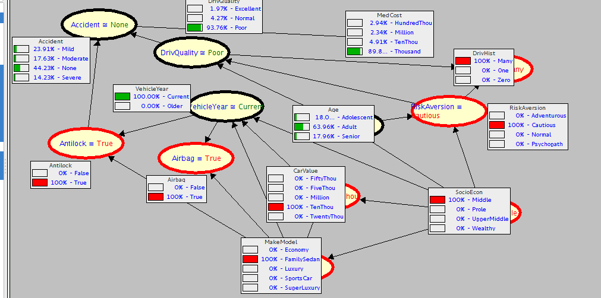

```{r, echo=FALSE}
setwd('/home/mbc/Dropbox/ITAM_Dropbox/Estadística Multivariada/Tareas_Git/Tarea_04')
```

En este ejercicio utilizaremos la base de datos *insurance* incluida en el paquete *bnlearn*. 

De acuerdo a un experto se ajustó una red con las siguientes consideraciones:

* Edad debe ser una variable raíz (no puede haber aristas con dirección a edad).
* La única determinante de nivel socioeconómico puede ser la edad, en caso de que sea necesario.
* El costo médico es independiente de la edad y nivel socieconómico dado las características del accidente y el tipo de coche (en particular, no puede haber aristas entre edad/nivel socioeconómico y costo médico).
* No puede haber aristas de existencia de bolsa de aire hacia calidad de conductor, historia de manejo o accidente, ni tampoco de accidente hacia tipo de coche o hacia año del coche.

La red es la siguiente:

```{r, message=FALSE}
library(bnlearn)
library(dplyr)
```

```{r}
set.seed(128)

vars <- c('Age', 'RiskAversion', 'VehicleYear', 'Accident', 'MakeModel', 
          'DrivQuality', 'Airbag', 'DrivHist', 'SocioEcon', 'Antilock', 
          'MedCost', 'CarValue')
blacklist_1 <- data.frame(from = vars[-1], to = 'Age')
blacklist_2 <- data.frame(from = c('MedCost', 'MedCost', 'Accident', 'Accident'), 
                          to = c('Age', 'SocioEcon', 'MakeModel', 'DrivQuality'))
blacklist_3 <- data.frame(from = c('Age', 'SocioEcon'), to = c('MedCost'))
blacklist_4 <- data.frame(from = vars[-1], to = 'SocioEcon')
blist <- rbind(blacklist_1, blacklist_2, blacklist_3, blacklist_4)
net_insurance <- hc(insurance[, vars], score = 'bic', blacklist = blist)
graphviz.plot(net_insurance)
```

# 1. Usa máxima verosimilitud para estimar los parámetros de los modelos locales, utiliza la base de datos *insurance_sub* que se crea con las siguientes líneas:

```{r}
set.seed(3656723)
insurance_sub <- sample_n(insurance, 3000)
```

Primero creamos la red correspondiente a *insurance_sub*.

```{r}
net_insurance_sub <- hc(insurance_sub[, vars],  score = 'aic', blacklist = blist)
graphviz.plot(net_insurance_sub)
```


Calculando por máxima verosimilitud:

```{r}
fit_insurance_mle <- bn.fit(net_insurance_sub, data = insurance_sub[,vars], method = 'mle')
write.net("./insurance_sub.net", fit_insurance_mle)
```

# 2. Exporta la red a SAMIAM y realiza algunos querys, ¿es necesario modificar alguna tabla de probabilidad condicional? es decir, ¿las estimaciones son ruidosas para algún nodo?

Sí, es necesario modificar por lo menos una probabilidad condicional, pues, como se puede ver en la figura, bajo las condiciones seleccionadas, se le asigna probabilidad cero a un coche viejo.



# 3. Utiliza un modelo logístico para modelar el nodo Antilock y una logística multinomial (por ejemplo de glmnet) para describir la relación VehicleYear -> CarValue <- MakeModel. Explica qué relaciones de independencia y dependencia describe este colisionador. Por ejemplo, si conozco que el valor del coche es de TenThou, ¿qué información del modelo de coche (MakeModel) aporta saber que el coche es nuevo Current?

```{r}
mod1 <- glm(Antilock ~ VehicleYear + MakeModel, family='binomial', data=insurance_sub)
summary(mod1)
```

Al parecer la variable *MakeModel* no es significativa. Probamos un nuevo modelo con la variable *VehicleYear* únicamente.

```{r}
mod2 <- glm(Antilock ~ VehicleYear, family='binomial', data=insurance_sub)
summary(mod2)
```

Según este modelo, hay una relación negativa entre si el vehículo es viejo si el auto tiene *antilock*.

Ajustamos ahora un modelo para *CarValue*.

```{r}
mod3 <- glm(CarValue ~ VehicleYear + MakeModel, family='binomial', data=insurance_sub)
summary(mod3)
```

En este modelo tampoco parece haber relaciones significativas.


